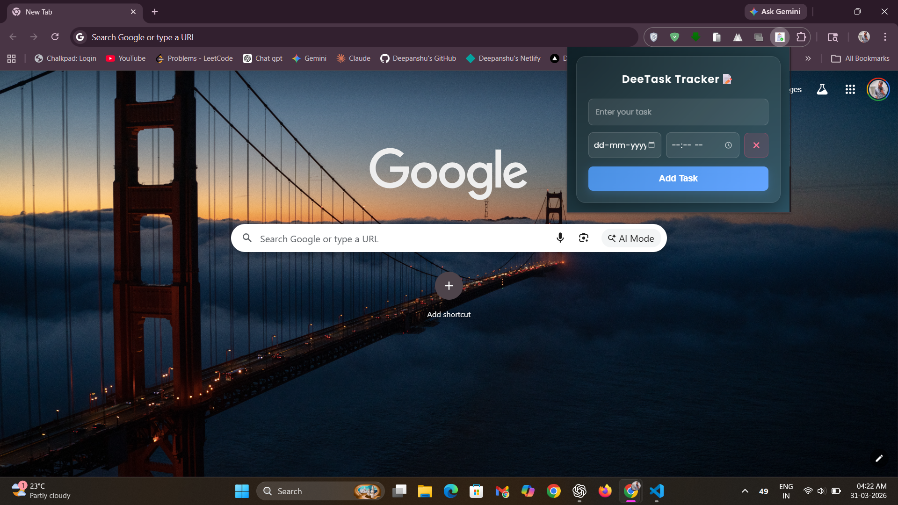
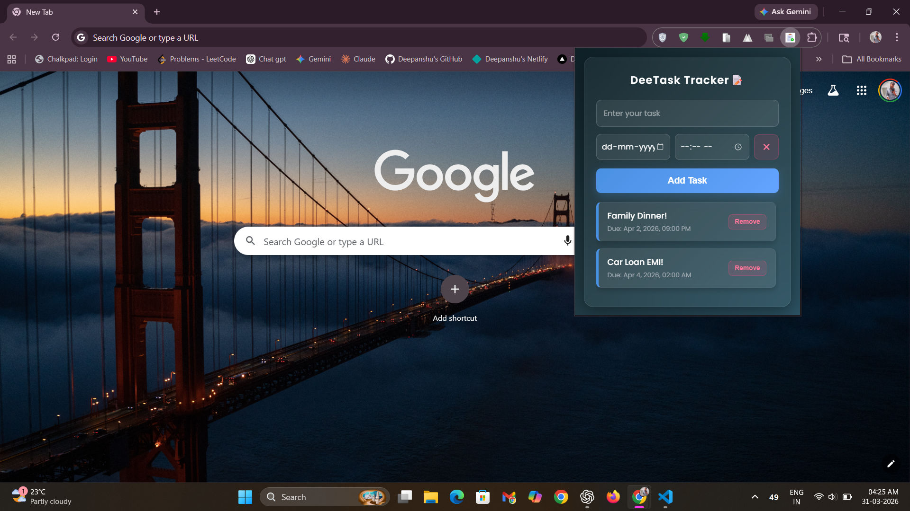

# 📝 DeeTask Tracker


- **DeeTask Tracker** is a modern Chrome extension designed to help you manage tasks efficiently right from your browser.  
- It combines a clean glassmorphic interface with powerful features like deadline tracking and seamless synchronization across devices.
- Tasks are automatically synced using the Chrome Storage Sync API and are linked to your Google account.  
- This means your tasks stay updated across all devices where you are signed into Chrome, without any manual setup.

## ✨ Key Features

- 🎨 **Modern Glassmorphic UI**  
  Clean frosted-glass design with smooth blur effects and subtle neon accents for a premium feel.

- ☁️ **Automatic Cloud Sync**  
  Uses Chrome Storage Sync to keep your tasks available across all devices logged into your Chrome account.

- ⏰ **Deadline Management**  
  Separate date and time inputs allow you to set precise deadlines without clutter.

- ⚡ **Quick Task Actions**  
  Easily add and delete tasks with responsive buttons and instant feedback.

- 💾 **Persistent Storage**  
  Tasks remain saved even after closing or restarting the browser.

## 🛠️ Tech Stack

- **Frontend:** HTML5, CSS3 (Flexbox, Glassmorphism, Backdrop Filters)  
- **Logic:** JavaScript (ES6+)  
- **Storage:** Chrome Storage Sync API  
- **Design:** Google Fonts (Poppins), Custom Icons  

## 📸 Screenshots

  
_A clean glassmorphic interface showing task input and list._

  
_View of tasks with deadlines displayed clearly._

## 🚀 Setup & Installation

### 1. Clone the Repository
```bash
git clone https://github.com/deepanshu1420/DeeTask-Tracker-Chrome-Extension.git
cd DeeTask-Tracker-Chrome-Extension 
```

### 2. Project Structure
```
DeeTask-Tracker/
├── images/
│   ├── icon16.png
│   ├── icon48.png
│   └── icon128.png
├── manifest.json
├── popup.html
├── popup.css
└── popup.js
```

### 3. Load Extension in Chrome
- Open `chrome://extensions/`
- Enable Developer mode (top right corner)
- Click Load unpacked
- Select your project folder (that u just cloned!)
- Click the Refresh 🔄 button on your extension (if already loaded)
- Pin 🧩 the extension from the toolbar

## 📜 License

This project is open-source and available under the MIT License.

## ❤️ Author

Developed with care by [Deepanshu Sharma](https://github.com/deepanshu1420)